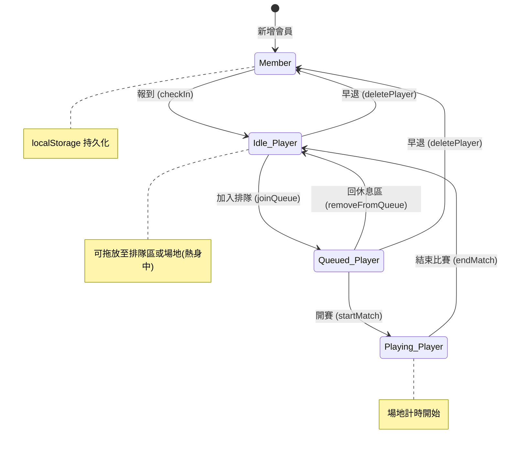

# 羽球排隊助手 — 專案規格書 (spec.md)

> **最後更新**：2026-03-31
> 本文件記錄專案的架構、流程與功能，供後續開發者快速理解並確保一致性。

---

## 目錄

1. [專案概述](#1-專案概述)
2. [技術棧](#2-技術棧)
3. [目錄結構](#3-目錄結構)
4. [資料模型](#4-資料模型)
5. [核心流程](#5-核心流程)
6. [功能清單](#6-功能清單)
7. [UI 佈局與元件](#7-ui-佈局與元件)
8. [狀態管理](#8-狀態管理)
9. [持久化策略](#9-持久化策略)
10. [部署與 CI/CD](#10-部署與-cicd)
11. [開發與維護規範](#11-開發與維護規範)

---

## 1. 專案概述

**羽球排隊助手 (BadmintonQueue)** 是一套專為羽球場設計的排隊管理系統，用於管理多面球場的球員輪替。系統支援會員管理、報到、排隊、自動語音唱名、熱身階段控制等功能，適合社團或場館日常使用。

### 核心價值

- 公平排隊：按先後順序排隊，4 人一組自動配場
- 即時管理：拖拉 / 點選操作，快速調整隊伍
- 語音唱名：開賽時自動語音播報球員與場地
- 會員持久化：透過 localStorage 保留會員與場地狀態

---

## 2. 技術棧

| 類別 | 技術 | 版本 |
| --- | --- | --- |
| 框架 | React | 19.2.0 |
| 語言 | TypeScript | ~5.8.2 |
| 建置工具 | Vite | ^6.2.0 |
| CSS | TailwindCSS (CDN) | 最新 |
| Icon 庫 | lucide-react | ^0.554.0 |
| 字型 | Inter (Google Fonts) | — |
| 部署 | GitHub Pages | — |

---

## 3. 目錄結構

```
badminton-queue/
├── .github/
│   └── workflows/
│       └── deploy.yml          # GitHub Pages 自動部署
├── components/
│   ├── CourtCard.tsx           # 場地卡片元件
│   └── PlayerAvatar.tsx        # 球員頭像元件（依名字 hash 產生一致顏色）
├── App.tsx                     # 主應用 — 所有狀態與邏輯集中於此
├── App.tsx.backup              # 備份檔
├── index.html                  # HTML 入口（TailwindCDN、字型、scrollbar 樣式）
├── index.tsx                   # React 入口（掛載 App 至 #root）
├── types.ts                    # TypeScript 型別定義與常數
├── metadata.json               # 應用 metadata
├── vite.config.ts              # Vite 設定（含 GitHub Actions base path）
├── tsconfig.json               # TypeScript 設定
├── package.json                # 依賴與腳本
└── README.md                   # 專案說明
```

---

## 4. 資料模型

### 4.1 型別定義（`types.ts`）

```typescript
type PlayerStatus = 'idle' | 'queued' | 'playing';
type SkillLevel = 'beginner' | 'intermediate';

interface Player {
  id: string;          // UUID
  name: string;        // 球員姓名
  status: PlayerStatus;
  level: SkillLevel;
  joinedAt: number;    // timestamp
}

interface Court {
  id: number;
  name: string;        // 場地名稱（可重新命名）
  playerIds: string[]; // 場上球員 ID 列表（最多 4 人）
  startTime: number | null; // 比賽開始時間
}

interface Member {
  id: string;          // UUID
  name: string;
  level: SkillLevel;   // 季打 / 零打
  createdAt: number;
}
```

### 4.2 常數

| 常數 | 值 | 說明 |
| --- | --- | --- |
| `MAX_PLAYERS_PER_COURT` | 4 | 每場最多人數（雙打） |
| `INITIAL_COURT_COUNT` | 6 | 預設場地數量 |

### 4.3 技能等級

| Key | 標籤 | 顏色系 |
| --- | --- | --- |
| `beginner` | 季打 | emerald（綠色） |
| `intermediate` | 零打 | blue（藍色） |

---

## 5. 核心流程

### 5.1 球員生命週期

```
會員列表 (Member)
   │
   │ [報到 checkIn]
   ▼
休息區 (idle Player)
   │
   │ [加入排隊 joinQueue / insertIntoQueueAt]
   ▼
排隊區 (queued Player) ── 以 queueSlots 陣列維護順序
   │
   │ [開賽 startMatch] ── 取前 4 人送入空場地
   ▼
場地中 (playing Player) ── 計時開始
   │
   │ [結束比賽 endMatch]
   ▼
休息區 (idle Player) ── 可再次加入排隊
```

### 5.2 熱身階段 (Warmup)

```
熱身中 (isWarmupDone = false)
   │
   │ 場地允許自由拖放球員（不受排隊限制）
   │ 球員可以跨場地移動
   │
   │ [所有場地滿場 → 可結束熱身]
   ▼
已熱身 (isWarmupDone = true)
   │
   │ 場地鎖定，球員只能透過排隊→開賽進入場地
   │ 場上球員不可再自由移動
```

### 5.3 開賽流程

```
1. 排隊區前 4 人自動組成「下一場組合」(nextMatchPlayers)
2. 管理者於空場地點選「打球囉」
3. 系統自動：
   a. 將 4 名球員狀態改為 playing
   b. 從 queueSlots 中移除
   c. 加入指定場地的 playerIds
   d. 記錄 startTime
   e. 若 isAutoAnnounce = true，語音播報：
      「請 OOO，OOO，OOO，OOO，到 場地X 打球」（重複兩次）
```

---

## 6. 功能清單

### 6.1 會員管理（報到區 Tab）

| 功能 | 說明 | 所在函式 |
| --- | --- | --- |
| 新增會員 | 輸入姓名、選擇等級後新增 | `createMember()` |
| CSV 批次匯入 | 上傳 .csv 檔案批量新增會員 | `parseCsvAndImport()`, `handleBatchImport()` |
| 搜尋會員 | 關鍵字即時篩選 | `filteredMembers` (useMemo) |
| 報到 | 將會員加入今日球員（休息區） | `checkInMember()` |
| 刪除會員 | 從會員列表永久移除 | `removeMember()` |
| 名單重置 | 清空尚未報到的會員 | Settings dropdown |
| 修改等級 | 點擊等級標籤切換（季打⇄零打） | `updateMemberLevel()` |

### 6.2 排隊管理（排隊區 Tab）

| 功能 | 說明 | 所在函式 |
| --- | --- | --- |
| 加入排隊 | 從休息區拖入或點選加入 | `joinQueue()` |
| 指定位置插入 | 拖入/點選到特定 slot | `insertIntoQueueAt()` |
| 隊內移動 | 拖拉交換位置 | `moveInQueue()` |
| 上移/下移 | 在隊列中上下調整 | `moveQueueItemUp()`, `moveQueueItemDown()` |
| 回休息區 | 從排隊移回休息區 | `removeFromQueue()` |
| 全部回休息 | 批量清空排隊區 | `restAllQueue()` |
| 清空休息區 | 批量讓休息區球員離場 | `clearBench()` |
| 早退 | 球員直接離場（回會員列表） | `deletePlayer()` |
| 修改等級 | 同會員等級修改並雙向同步 | `updatePlayerLevel()` |

### 6.3 場地管理（主區域）

| 功能 | 說明 | 所在函式 |
| --- | --- | --- |
| 開賽 | 取排隊前 4 人配入場地 | `startMatch()` |
| 結束比賽 | 場上 4 人回休息區，場地清空 | `endMatch()` |
| 自動語音播報 | 開賽時自動唱名（可關閉） | `speak()`, `isAutoAnnounce` |
| 手動語音播報 | 比賽中手動再次唱名 | `announceCourtPlayers()` |
| 場地重新命名 | 點擊編輯圖示修改場地名稱 | `renameCourt()` |
| 增減場地 | 動態調整場地數量（最少 1 面） | `addCourt()`, `removeCourt()` |
| 計時器 | 比賽開始後即時顯示已用時間 | CourtCard 內部 `useEffect` |
| 拖放球員至場地 | 熱身階段可直接拖球員入場 | `dropPlayerToCourt()` |
| 調整場上位置 | 點選或拖拉調整場內位置 | `movePlayerToCourtSlot()` |
| 從場地移除 | 將球員從場地中移出 | `removePlayerFromCourt()` |

### 6.4 全局功能

| 功能 | 說明 | 所在函式 |
| --- | --- | --- |
| 熱身開關 | 控制是否為熱身階段 | `handleWarmupToggle()` |
| 打球結束 | 一鍵清空所有活動球員（回會員列表） | `resetSession()` |
| 側邊欄收合 | 行動裝置可關閉/開啟側邊欄 | `isSidebarOpen` |
| 報到成功提示 | 報到後自動顯示 2 秒成功 Modal | `checkInSuccessName` |
| 鍵盤快捷鍵 | Escape 取消選中的球員 | `useEffect` (keydown) |
| 即時時鐘 | 每秒更新（用於場地計時） | `useEffect` (setInterval) |

---

## 7. UI 佈局與元件

### 7.1 整體佈局

```
┌──────────────────────────────────────────────────────┐
│                  (整個畫面 h-full)                     │
│  ┌──────────────┐  ┌──────────────────────────────┐  │
│  │   Sidebar    │  │         Main Content          │  │
│  │  (w-[25rem]) │  │         (flex-1)              │  │
│  │              │  │  ┌──────────────────────────┐ │  │
│  │  ┌────────┐  │  │  │       Toolbar            │ │  │
│  │  │App     │  │  │  │ 場地狀況 / 場地±/ 熱身   │ │  │
│  │  │Header  │  │  │  │ / 打球結束              │ │  │
│  │  └────────┘  │  │  └──────────────────────────┘ │  │
│  │  ┌────────┐  │  │  ┌──────────────────────────┐ │  │
│  │  │  Tabs  │  │  │  │    Courts Grid           │ │  │
│  │  │報到/排隊│  │  │  │  ┌──────┐  ┌──────┐     │ │  │
│  │  └────────┘  │  │  │  │Court1│  │Court2│ ... │ │  │
│  │  ┌────────┐  │  │  │  └──────┘  └──────┘     │ │  │
│  │  │  Tab   │  │  │  │  ┌──────┐  ┌──────┐     │ │  │
│  │  │Content │  │  │  │  │Court3│  │Court4│ ... │ │  │
│  │  │(scroll)│  │  │  │  └──────┘  └──────┘     │ │  │
│  │  └────────┘  │  │  └──────────────────────────┘ │  │
│  └──────────────┘  └──────────────────────────────┘  │
└──────────────────────────────────────────────────────┘
```

### 7.2 元件清單

| 元件 | 檔案 | 職責 |
| --- | --- | --- |
| `App` | `App.tsx` | 主元件，管理所有狀態與業務邏輯 |
| `CourtCard` | `components/CourtCard.tsx` | 單一場地卡片：顯示球員、計時、開賽/結束按鈕、拖放互動 |
| `PlayerAvatar` | `components/PlayerAvatar.tsx` | 球員頭像：根據名字 hash 分配固定顏色的圖示 |
| `LevelSelector` | `App.tsx` 內 | 技能等級切換按鈕（行內元件） |

### 7.3 CourtCard 狀態視覺

| 狀態 | 邊框 | 圓點 | 行動按鈕 |
| --- | --- | --- | --- |
| 空場 | `border-slate-800` | 灰色 | 打球囉 / 空場 |
| 有人（未開賽） | `border-amber-500/30` | 琥珀色 | 等待中 (N/4) |
| 比賽中 | `border-indigo-500/30` | 綠色 + pulse | 結束比賽（下場） |

---

## 8. 狀態管理

### 8.1 核心狀態（useState）

| 狀態名 | 類型 | 說明 | 持久化 |
| --- | --- | --- | --- |
| `players` | `Player[]` | 今日所有活動球員 | ✅ localStorage |
| `courts` | `Court[]` | 所有場地 | ✅ localStorage |
| `members` | `Member[]` | 會員名冊 | ✅ localStorage |
| `queueSlots` | `(string \| null)[]` | 排隊順序（slot-based，null=空位） | ❌ |
| `isWarmupDone` | `boolean` | 熱身是否結束 | ❌ |
| `activeTab` | `'queue' \| 'members'` | 側邊欄 Tab（預設 members） | ❌ |
| `isSidebarOpen` | `boolean` | 側邊欄展開狀態 | ❌ |
| `isAutoAnnounce` | `boolean` | 是否自動語音播報 | ❌ |
| `selectedPlayerForMove` | `string \| null` | 點選移動模式中被選中的球員 | ❌ |

### 8.2 衍生資料（useMemo）

| 名稱 | 說明 |
| --- | --- |
| `queue` | 排隊中的球員列表（從 queueSlots 解析） |
| `idlePlayers` | 休息中球員（按 joinedAt 降序） |
| `filteredIdlePlayers` | 休息區搜尋篩選結果 |
| `nextMatchPlayers` | 下一場球員（排隊前 4 人） |
| `isQueueReady` | 是否已有 4 人可開賽 |
| `filteredMembers` | 會員搜尋篩選結果 |
| `checkedInMembers` / `notCheckedInMembers` | 已報到 / 未報到會員分組 |
| `queueDisplayItems` | 排隊區 UI 顯示資料（含空位） |
| `chunkedQueueItems` | 每 4 人一組的排隊顯示 |
| `totalActivePlayers` | 場上正在打球的人數 |
| `idleCourtsCount` | 空閒場地數 |

### 8.3 排隊系統設計（Slot-Based Queue）

排隊使用 `queueSlots: (string | null)[]` 而非簡單的 Player 陣列：

- 每個 slot 可以是球員 ID 或 `null`（空位）
- 支援指定位置插入、交換、拖放
- UI 以 4 人一組分 chunk 顯示，模擬場地分組
- Trailing nulls 會自動修剪（`while pop`）

---

## 9. 持久化策略

| Key | 資料 | 時機 |
| --- | --- | --- |
| `badminton_players` | `Player[]` JSON | players 變更時 |
| `badminton_courts` | `Court[]` JSON | courts 變更時 |
| `badminton_members` | `Member[]` JSON | members 變更時 |

> **Migration 機制**：從 localStorage 載入時，自動補上缺少的 `level` 欄位（預設 `'intermediate'`），確保向後相容。

---

## 10. 部署與 CI/CD

### GitHub Pages 自動部署

- **觸發條件**：push 到 `main` 分支
- **流程**：checkout → Node 22 安裝 → `npm ci` → `npm run build` → Upload artifact → Deploy
- **Base Path**：生產環境為 `/badminton-queue/`，本地開發為 `/`
- **設定位置**：`.github/workflows/deploy.yml` + `vite.config.ts`

### 本地開發

```bash
npm install
npm run dev     # 啟動 dev server (port 3000)
```

---

## 11. 開發與維護規範

### 11.1 新增功能注意事項

1. **型別優先**：新增資料欄位先更新 `types.ts`，確保型別安全
2. **Migration**：若修改既有資料結構，須在 `useState` 初始化時加入 migration 邏輯
3. **雙向同步**：修改球員等級時需同步 `players` 與 `members` 兩份狀態
4. **Slot 管理**：操作 `queueSlots` 後記得修剪 trailing nulls
5. **確認對話**：破壞性操作（刪除、清空、結束比賽）務必加 `confirm()` 確認

### 11.2 UI / UX 規範

- **深色主題**：以 `slate-900` / `slate-950` 為底色，搭配 `indigo` / `emerald` / `amber` 語意色
- **動畫**：使用 `animate-[fadeIn_0.3s_ease-out]` 做淡入過場
- **Hover 顯示**：次要操作按鈕預設隱藏，hover 時顯示（`opacity-0 group-hover:opacity-100`）
- **響應式設計**：
  - 行動版：sidebar 以 fixed overlay 呈現，透過 `translate-x` 滑出
  - 桌面版：sidebar 固定、場地 grid 自適應欄數 (`sm:grid-cols-2 2xl:grid-cols-3`)

### 11.3 語音播報規範

- 使用 Web Speech API (`SpeechSynthesisUtterance`)
- 語系：`zh-TW`
- 語速：`1.0` / 音調：`1.2`（偏高，活潑語氣）
- 每次播報兩遍（queue 兩個 utterance）
- 格式：`「請 A，B，C，D，到 場地X 打球」`

### 11.4 CSV 匯入格式

```csv
姓名,等級
王小明,季打
李大華,零打
```

支援的欄位名稱：
- 姓名：`姓名` / `name` / `名稱`
- 等級：`等級` / `狀態` / `level` / `技能`

支援的等級值：
- 零打 (intermediate)：`intermediate` / `一般` / `零打` / `中階` / `中级`
- 季打 (beginner)：`beginner` / `初階` / `初级` / `季打`

---

## 附錄：狀態轉換圖


