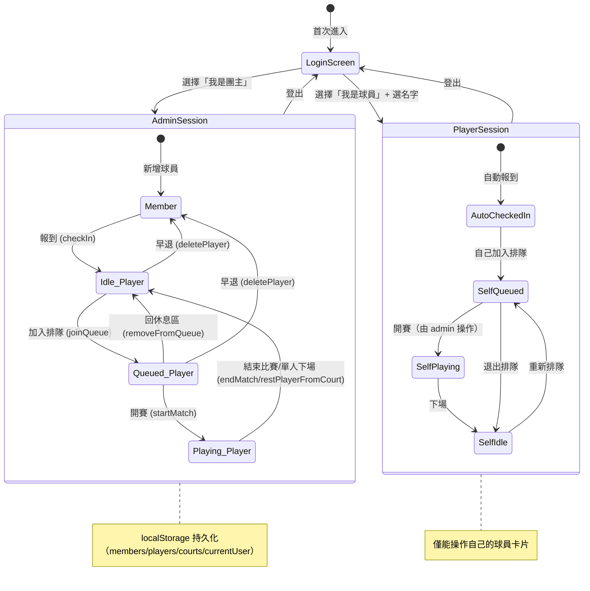

# 羽球排隊助手 — 專案規格書 (spec.md)

> **最後更新**：2026-06-17
> 本文件記錄專案的架構、流程與功能，供後續開發者快速理解並確保一致性。

---

## 目錄

1. [專案概述](#1-專案概述)
2. [技術棧](#2-技術棧)
3. [目錄結構](#3-目錄結構)
4. [資料模型](#4-資料模型)
5. [核心流程](#5-核心流程)
6. [功能清單](#6-功能清單)
7. [UI 佈局與元件](#7-ui-佈局與元件)
8. [狀態管理](#8-狀態管理)
9. [持久化策略](#9-持久化策略)
10. [部署與 CI/CD](#10-部署與-cicd)
11. [開發與維護規範](#11-開發與維護規範)

---

## 1. 專案概述

**羽球排隊助手 (BadmintonQueue)** 是一套專為羽球場設計的排隊管理系統，用於管理多面球場的球員輪替。系統支援球員管理、報到、排隊、自動語音唱名、熱身階段控制、以及角色權限控管（RBAC）等功能，適合社團或場館日常使用。

### 核心價值

- 公平排隊：按先後順序排隊，4 人一組自動配場
- 即時管理：拖拉 / 點選操作，快速調整隊伍
- 語音唱名：開賽時自動語音播報球員與場地
- 球員持久化：透過 localStorage 保留球員與場地狀態
- 角色區分：團主（admin）可全權管理；球員（player）只能操作自己

### 雲端多裝置同步與多租戶隔離機制

本系統具備多人協作的即時雲端數據同步架構，支援多個裝置（如團主的筆電與多位球員的手機）同時在線上檢視與操作：

- **Firebase Firestore 即時資料流**：利用 Firestore 的 WebSocket 長連線（`onSnapshot`）即時同步賽局狀態、球員名冊及空間元資料。當團主在後台開賽時，所有打球球員的手機皆能瞬間接收到更新，甚至同步啟動語音唱名。
- **多租戶隔離設計 (Namespace Partitioning)**：
  - 系統採用動態的「多租戶租用模式」。以瀏覽器網址的 Hash `#/space/{spaceId}` 作為租戶 Namespace 的區隔。
  - 不同的球團在 Firestore 中擁有完全獨立且隔離的文檔路徑（主路徑為 `spaces/{spaceId}/`，賽局狀態為 `spaces/{spaceId}/state/session`，球員子集合為 `spaces/{spaceId}/members/`）。各自的球員、場地和排隊狀態完全互不干涉。
- **降級備用機制 (Offline Fallback)**：當偵測到環境中未配置 Firebase 或連線失敗時，系統會自動無縫切換為本地「LocalStorage Mock 模式」，該模式依舊支援同台裝置跨頁面的即時同步，確保在離線或無雲端資源時系統仍可順暢運作。
- **安全防護機制**：
  - 為了保障多租戶環境下的安全性，專案不將任何 Firebase 的敏感管理金鑰或憑證寫入本規格文檔。
  - 租戶層級支援「管理員密碼」與「空間專屬存取密碼」。在未輸入空間存取密碼前，Firestore 監聽數據流將會被嚴格阻斷，確保私密球團的數據隱私與操作安全性。

---

## 2. 技術棧

| 類別     | 技術                 | 版本     |
| -------- | -------------------- | -------- |
| 框架     | React                | 19.2.0   |
| 語言     | TypeScript           | ~5.8.2   |
| 建置工具 | Vite                 | ^6.2.0   |
| CSS      | TailwindCSS (CDN)    | 最新     |
| Icon 庫  | lucide-react         | ^0.554.0 |
| 字型     | Inter (Google Fonts) | —        |
| 部署     | GitHub Pages         | —        |

---

## 3. 目錄結構

```
badminton-queue/
├── .github/
│   └── workflows/
│       └── deploy.yml          # GitHub Pages 自動部署
├── components/
│   ├── CourtCard.tsx           # 場地卡片元件
│   └── PlayerAvatar.tsx        # 球員頭像元件（依名字 hash 產生一致顏色）
├── App.tsx                     # 主應用 — 所有狀態與邏輯集中於此
├── index.html                  # HTML 入口（TailwindCDN、字型、scrollbar 樣式）
├── index.tsx                   # React 入口（掛載 App 至 #root）
├── types.ts                    # TypeScript 型別定義與常數
├── metadata.json               # 應用 metadata
├── vite.config.ts              # Vite 設定（含 GitHub Actions base path）
├── tsconfig.json               # TypeScript 設定
├── package.json                # 依賴與腳本
└── README.md                   # 專案說明
```

---

## 4. 資料模型

### 4.1 型別定義（`types.ts`）

```typescript
type PlayerStatus = "idle" | "queued" | "playing";
type MemberIdentity = "admin" | "beginner" | "intermediate";
type UserRole = "admin" | "player";

interface Player {
  id: string; // UUID
  name: string; // 球員姓名
  status: PlayerStatus;
  identity: MemberIdentity; // 球員身份 (社員/零打)
  joinedAt: number; // timestamp
}

interface Court {
  id: number;
  name: string; // 場地名稱（可重新命名）
  playerIds: (string | null)[]; // 場上球員 ID 列表（null 為空位，最多 4 人）
  startTime: number | null; // 比賽開始時間
}

interface Member {
  id: string; // UUID
  name: string;
  identity: MemberIdentity; // 球員身份 (社員/零打)
  createdAt: number;
}

interface CurrentUser {
  role: UserRole;
  memberId?: string; // 僅 player role 有此欄位，對應 Member.id
}
```

### 4.2 常數

| 常數                    | 值  | 說明                 |
| ----------------------- | --- | -------------------- |
| `MAX_PLAYERS_PER_COURT` | 4   | 每場最多人數（雙打） |
| `INITIAL_COURT_COUNT`   | 6   | 預設場地數量         |

### 4.3 球員身份

| Key            | 標籤   | 顏色系          | 說明                     |
| -------------- | ------ | --------------- | ------------------------ |
| `admin`        | 管理員 | rose（玫瑰色）  | 最顯眼                   |
| `beginner`     | 社員   | blue（藍色）   | 一般色（預設，最多人）   |
| `intermediate` | 零打   | violet（藍紫色）| 最不顯眼（不常出現）     |

---

## 5. 核心流程

### 5.1 球員生命週期

```
球員列表 (Member)
   │
   │ [報到 checkIn] ── 團主可直接報到；球員只能報到自己
   ▼
休息區 (idle Player)
   │
   │ [加入排隊 joinQueue / insertIntoQueueAt]
   ▼
排隊區 (queued Player) ── 以 queueSlots 陣列維護順序
   │
   │ [開賽 startMatch] ── 取第一個**完整 4 人組**送入空場地
   ▼
場地中 (playing Player) ── 計時開始
   │
   │ [結束比賽 endMatch] ── 全員回休息區
   │ [單人下場 restPlayerFromCourt] ── 個別回休息區（不結束比賽）
   ▼
休息區 (idle Player) ── 可再次加入排隊
```

### 5.2 熱身階段 (Warmup)

```
熱身中 (isWarmupDone = false)
   │
   │ 場地允許自由拖放球員（不受排隊限制）
   │ 球員可以跨場地移動
   │
   │ [所有場地滿場 → 可結束熱身]
   ▼
已熱身 (isWarmupDone = true)
   │
   │ 場地鎖定，球員只能透過排隊→開賽進入場地
   │ 場上球員不可再自由移動
```

### 5.3 開賽流程

```
1. 系統掃描 queueSlots，找出第一個**完整 4 人組**（連續 4 個非 null 的 slot）
2. 管理者於空場地點選「打球囉」
3. 系統自動：
   a. 將 4 名球員狀態改為 playing
   b. 從 queueSlots 中移除（後方球員自動前移填補）
   c. 加入指定場地的 playerIds
   d. 記錄 startTime
   e. 若 isAutoAnnounce = true，語音播報：
      「請 OOO，OOO，OOO，OOO，到 場地X 打球」（重複兩次）

注意：若第一組 4 個 slot 有空缺（null），不會從後方抓人補湊，
      而是等待那組補滿後才能開賽。
```

### 5.4 登入流程

```
進入應用（未登入）
   │
   ├─ [我是團主] ──→ role = 'admin'，直接進入系統（無需身分驗證）
   │
   └─ [我是球員] ──→ 顯示球員列表（可搜尋）
                      │
                      └─ 選擇自己名字 ──→ role = 'player'，memberId = 對應 Member.id
                                          自動觸發 checkInMember()
                                          ├─ 若未在場上 ──→ 進入排隊區 Tab 並自動選取自己
                                          └─ 若已在場上 ──→ 進入場地區 Tab，清除選取狀態，並平滑滾動對齊到場上槽位且閃爍 2 次白色呼吸燈
```

---

## 6. 功能清單

### 6.1 球員管理（報到區 Tab）

| 功能         | 說明                          | 所在函式                                     | 權限         |
| ------------ | ----------------------------- | -------------------------------------------- | ------------ |
| 新增球員     | 輸入姓名、選擇身份後新增      | `createMember()`                             | admin        |
| CSV 批次匯入 | 上傳 .csv 檔案批量新增球員    | `parseCsvAndImport()`, `handleBatchImport()` | admin        |
| 搜尋球員     | 關鍵字即時篩選                | `filteredMembers` (useMemo)                  | 全部         |
| 球員排序     | 支援新舊、姓名 A-Z (英文優先)、身份排序 | `memberSortKey`, `isSortMenuOpen`  | admin        |
| 報到         | 將球員加入今日球員（休息區）  | `checkInMember()`                            | admin / 本人 |
| 刪除球員     | 從球員列表永久移除            | `removeMember()`                             | admin        |
| 名單重置     | 清空尚未報到的球員            | Settings dropdown                            | admin        |

> **注意**：球員 role 僅能看到「排隊區」Tab，報到區對球員隱藏。

### 6.2 排隊管理（排隊區 Tab）

| 功能         | 說明                           | 所在函式                                   | 權限         |
| ------------ | ------------------------------ | ------------------------------------------ | ------------ |
| 加入排隊     | 從休息區拖入或點選加入         | `joinQueue()`                              | admin / 本人 |
| 指定位置插入 | 拖入/點選到特定 slot           | `insertIntoQueueAt()`                      | admin / 本人 |
| 隊內移動     | 拖拉交換位置                   | `moveInQueue()`                            | admin / 本人 |
| 上移/下移    | 在隊列中上下調整               | `moveQueueItemUp()`, `moveQueueItemDown()` | admin / 本人 |
| 回休息區     | 從排隊移回休息區               | `removeFromQueue()`                        | admin / 本人 |
| 全部回休息   | 批量清空排隊區                 | `restAllQueue()`                           | admin        |
| 早退         | 球員直接離場（回球員列表）     | `deletePlayer()`                           | admin / 本人 |
| 自己優先顯示 | 登入球員名字自動排在休息區最前 | `filteredIdlePlayers` (useMemo)            | —            |

### 6.3 場地管理（主區域）

| 功能           | 說明                           | 所在函式                      | 權限         |
| -------------- | ------------------------------ | ----------------------------- | ------------ |
| 開賽           | 取排隊第一完整 4 人組配入場地  | `startMatch()`                | admin        |
| 結束比賽       | 場上 4 人回休息區，場地清空    | `endMatch()`                  | admin        |
| 單人下場       | 個別球員回休息區（不結束場地） | `restPlayerFromCourt()`       | admin        |
| 自動語音播報   | 開賽時自動唱名（可關閉）       | `speak()`, `isAutoAnnounce`   | admin        |
| 手動語音播報   | 比賽中手動再次唱名             | `announceCourtPlayers()`      | admin        |
| 場地重新命名   | 點擊編輯圖示修改場地名稱       | `renameCourt()`               | admin        |
| 增減場地       | 動態調整場地數量（最少 1 面）  | `addCourt()`, `removeCourt()` | admin        |
| 計時器         | 比賽開始後即時顯示已用時間     | CourtCard 內部 `useEffect`    | 全部（唯讀） |
| 拖放球員至場地 | 熱身階段可直接拖球員入場       | `dropPlayerToCourt()`         | admin        |
| 調整場上位置   | 點選或拖拉調整場內位置         | `movePlayerToCourtSlot()`     | admin        |

### 6.4 全局功能

| 功能            | 說明                                                      | 所在函式                        | 權限  |
| --------------- | --------------------------------------------------------- | ------------------------------- | ----- |
| 熱身開關        | 控制是否為熱身階段                                        | `handleWarmupToggle()`          | admin |
| 打球結束        | 一鍵清空所有活動球員（回球員列表）                        | `resetSession()`                | admin |
| 行動裝置 Tab    | 行動裝置使用底部 Tab 切換畫面（報到/排隊/場地）           | `activeTab`                     | 全部  |
| 休息區面板      | 使用懸浮按鈕 (FAB) 開啟底部抽屜 (Bottom Sheet) 顯示休息區 | `isRestAreaOpen`                | 全部  |
| 懸浮動作氣泡    | 點選球員移動時，在該球員右上角顯示操作按鈕（休息/早退）   | `selectedPlayerForMove`         | 全部  |
| 報到成功提示    | 報到後自動顯示 2 秒成功 Modal                             | `checkInSuccessName`            | —     |
| 鍵盤快捷鍵      | Escape 取消選中的球員                                     | `useEffect` (keydown)           | —     |
| 即時時鐘        | 每秒更新（用於場地計時）                                  | `useEffect` (setInterval)       | —     |
| 登入 / 登出     | 身分選擇與切換，球員選單與下拉選單提供登出與早退按鈕       | `currentUser`, profile dropdown | 全部  |
| 早退掰掰畫面    | 球員早退後展示 5s 動態小雞掰掰畫面，倒數結束自動無閃爍返大廳| `goodbyePlayerName`, `goodbyeCountdown` | 全部 |

### 6.5 RBAC（角色權限控管）

| 角色             | 說明           | 限制                                                          |
| ---------------- | -------------- | ------------------------------------------------------------- |
| `admin`（團主）  | 完整管理權限   | 無                                                            |
| `player`（球員） | 以自身身分登入 | 只能操作自己的球員；報到區隱藏；熱身/打球結束等管理操作不可用 |

**權限判斷函式**：`canMovePlayer(playerId)` — 回傳 `true` 若當前登入者為 admin，或該球員名字與登入者名字相符。

---

## 7. UI 佈局與元件

### 7.1 整體佈局

```
┌──────────────────────────────────────────────────────┐
│                  (整個畫面 h-full)                     │
│  ┌────────────────────────────────────────────────┐  │
│  │ Global Header (一般模式 / Action Mode 提示)       │  │
│  └────────────────────────────────────────────────┘  │
│  ┌──────────────┐  ┌──────────────────────────────┐  │
│  │   Sidebar    │  │         Main Content          │  │
│  │  (w-[25rem]) │  │         (flex-1)              │  │
│  │  ┌────────┐  │  │  ┌──────────────────────────┐ │  │
│  │  │  Tabs  │  │  │  │       Toolbar            │ │  │
│  │  │報到/排隊│  │  │  │ 場地狀況 / 場地± / 熱身   │ │  │
│  │  └────────┘  │  │  └──────────────────────────┘ │  │
│  │  ┌────────┐  │  │  ┌──────────────────────────┐ │  │
│  │  │  Tab   │  │  │  │    Courts Grid           │ │  │
│  │  │Content │  │  │  │  ┌──────┐  ┌──────┐     │ │  │
│  │  │(scroll)│  │  │  │  │Court1│  │Court2│ ... │ │  │
│  │  └────────┘  │  │  │  └──────┘  └──────┘     │ │  │
│  └──────────────┘  │  └──────────────────────────┘ │  │
│                    └──────────────────────────────┘  │
│  ┌────────────────────────────────────────────────┐  │
│  │ Mobile Tabs (僅行動版顯示：報到/排隊/場地)           │  │
│  └────────────────────────────────────────────────┘  │
│  [ FAB 懸浮按鈕：休息區 (點擊彈出 Bottom Sheet) ]        │
└──────────────────────────────────────────────────────┘
```

### 7.2 元件清單

| 元件               | 檔案                          | 職責                                                          |
| ------------------ | ----------------------------- | ------------------------------------------------------------- |
| `App`              | `App.tsx`                     | 主元件，管理所有狀態與業務邏輯                                |
| `CourtCard`        | `components/CourtCard.tsx`    | 單一場地卡片：顯示球員、計時、開賽/結束按鈕、拖放互動         |
| `PlayerAvatar`     | `components/PlayerAvatar.tsx` | 球員頭像：根據名字 hash 分配固定顏色的圓點圖示                |
| `MemberIdentity Badge` | 行內樣式                      | 顯示球員/球員的身份標籤（社員/零打）                          |
| 登入畫面           | `App.tsx` 內                  | 角色選擇（團主 / 球員）與球員身分選擇搜尋                     |
| Profile Dropdown   | `App.tsx` 內                  | 顯示當前登入身分，提供登出/切換功能，click-outside 自動關閉   |
| 懸浮動作氣泡       | `App.tsx` / `CourtCard.tsx`   | 點選球員移動時，在球員卡片/欄位右上角懸浮顯示（休息/早退）    |
| 休息區 (Rest Area) | `App.tsx` 內                  | 以懸浮按鈕 (FAB) 及 Bottom Sheet 實作，支援快速搜尋與點選拖拉 |

### 7.3 CourtCard 狀態視覺

| 狀態           | 邊框                   | 圓點         | 行動按鈕         |
| -------------- | ---------------------- | ------------ | ---------------- |
| 空場           | `border-slate-800`     | 灰色         | 打球囉 / 空場    |
| 有人（未開賽） | `border-amber-500/30`  | 琥珀色       | 等待中 (N/4)     |
| 比賽中         | `border-indigo-500/30` | 綠色 + pulse | 結束比賽（下場） |

### 7.4 當前登入者高亮規則

登入者（`currentMemberName`）在以下位置均以**白色粗體 + 淡白底**顯示：

| 位置                | 視覺效果                                                               |
| ------------------- | ---------------------------------------------------------------------- |
| 排隊區 (queueSlots) | `bg-slate-100/10`, `border-slate-300/30`, 白色粗體名字                 |
| 休息區 (idle list)  | `bg-slate-100/10`, `border-slate-300/30`, 白色粗體名字；自動排序至最前 |
| 場地中 (CourtCard)  | 金色（`text-yellow-400`）粗體顯示                                      |

---

## 8. 狀態管理

### 8.1 核心狀態（useState）

| 狀態名                  | 類型                               | 說明                                        | 持久化          |
| ----------------------- | ---------------------------------- | ------------------------------------------- | --------------- |
| `currentUser`           | `CurrentUser \| null`              | 當前登入者（角色+memberId）                 | ✅ localStorage |
| `players`               | `Player[]`                         | 今日所有活動球員                            | ✅ localStorage |
| `courts`                | `Court[]`                          | 所有場地                                    | ✅ localStorage |
| `members`               | `Member[]`                         | 球員名冊                                    | ✅ localStorage |
| `queueSlots`            | `(string \| null)[]`               | 排隊順序（slot-based，null=空位）           | ❌              |
| `isWarmupDone`          | `boolean`                          | 熱身是否結束                                | ❌              |
| `activeTab`             | `'courts' \| 'queue' \| 'members'` | 主畫面 Tab 切換（支援行動版及桌面版側邊欄） | ❌              |
| `isRestAreaOpen`        | `boolean`                          | 休息區底部抽屜 (Bottom Sheet) 開關狀態      | ❌              |
| `isAutoAnnounce`        | `boolean`                          | 是否自動語音播報                            | ❌              |
| `selectedPlayerForMove` | `string \| null`                   | 點選移動模式中被選中的球員                  | ❌              |
| `isProfileMenuOpen`     | `boolean`                          | Profile Dropdown 開關                       | ❌              |

### 8.2 衍生資料（useMemo）

| 名稱                                       | 說明                                   |
| ------------------------------------------ | -------------------------------------- |
| `currentMemberName`                        | 當前登入球員的姓名（admin 為 null）    |
| `queue`                                    | 排隊中的球員列表（從 queueSlots 解析） |
| `idlePlayers`                              | 休息中球員（按 joinedAt 降序）         |
| `filteredIdlePlayers`                      | 休息區搜尋篩選結果（登入者自動排最前） |
| `nextMatchPlayers`                         | 下一場球員（第一個完整 4 人組）        |
| `isQueueReady`                             | 是否已有完整 4 人可開賽                |
| `filteredMembers`                          | 球員搜尋篩選結果                       |
| `checkedInMembers` / `notCheckedInMembers` | 已報到 / 未報到球員分組                |
| `queueDisplayItems`                        | 排隊區 UI 顯示資料（含空位）           |
| `chunkedQueueItems`                        | 每 4 人一組的排隊顯示                  |
| `idleCourtsCount`                          | 空閒場地數                             |

### 8.3 排隊系統設計（Slot-Based Queue）

排隊使用 `queueSlots: (string | null)[]` 而非簡單的 Player 陣列：

- 每個 slot 可以是球員 ID 或 `null`（空位）
- 支援指定位置插入、交換、拖放
- UI 以 4 人一組分 chunk 顯示，模擬場地分組
- Trailing nulls 會自動修剪（`while pop`）

### 8.4 開賽邏輯（隊伍完整性）

```typescript
// 掃描 queueSlots，取第一個完整 4 人組（不跳過空位補人）
const getNextMatchBatch = (slots, players) => {
  for (let i = 0; i < slots.length; i += MAX_PLAYERS_PER_COURT) {
    const chunk = slots.slice(i, i + MAX_PLAYERS_PER_COURT);
    if (chunk.length === 4 && chunk.every((id) => id !== null)) {
      return chunk.map((id) => playerMap.get(id));
    }
  }
  return []; // 沒有完整組
};
```

若第一組有空缺（null slot），`isQueueReady = false`，「打球囉」按鈕不可點。

---

## 9. 持久化策略

| Key                      | 資料               | 時機               |
| ------------------------ | ------------------ | ------------------ |
| `badminton_current_user` | `CurrentUser` JSON | currentUser 變更時 |
| `badminton_players`      | `Player[]` JSON    | players 變更時     |
| `badminton_courts`       | `Court[]` JSON     | courts 變更時      |
| `badminton_members`      | `Member[]` JSON    | members 變更時     |

> **Migration 機制**：從 localStorage 或 Firestore 載入時，將 `level` 舊欄位映射至 `identity`（若皆無則預設 `'beginner'`）以確保向後相容。寫入時只會寫入 `identity` 新欄位，不再寫入/同步 `level`。

---

## 10. 部署與 CI/CD

### GitHub Pages 自動部署

- **觸發條件**：push 到 `main` 分支
- **流程**：checkout → Node 22 安裝 → `npm ci` → `npm run build` → Upload artifact → Deploy
- **Base Path**：生產環境為 `/badminton-queue/`，本地開發為 `/`
- **設定位置**：`.github/workflows/deploy.yml` + `vite.config.ts`

### 本地開發

```bash
npm install
npm run dev     # 啟動 dev server (port 3000)
```

---

## 11. 開發與維護規範

### 11.1 新增功能注意事項

1. **型別優先**：新增資料欄位先更新 `types.ts`，確保型別安全
2. **Migration**：若修改既有資料結構，須在 `useState` 初始化時加入 migration 邏輯
3. **雙向同步**：修改球員身份時需同步 `players` 與 `members` 兩份狀態
4. **Slot 管理**：操作 `queueSlots` 後記得修剪 trailing nulls
5. **確認對話**：破壞性操作（刪除、清空、結束比賽）務必調用 `showConfirm()` 或 `showAlert()`，以顯示全站統一的自訂 Promise-based 的 Dialog 模態對話框（統一為靛藍色系，移除了多餘的 redundant 標題文字）。針對刪除球團空間，須使用專屬的刪除確認 Modal (`isDeleteConfirmOpen`)，採用 GitHub 風格的防呆機制，要求輸入 `spaceId` 比對完全一致後方可解鎖刪除按鈕。
6. **權限守衛**：新增任何可操作按鈕前，確認是否需要加 `currentUser?.role === 'admin'` 或 `canMovePlayer()` 判斷

### 11.2 UI / UX 規範

- **深色主題**：以 `slate-900` / `slate-950` 為底色，搭配 `indigo` / `emerald` / `amber` 語意色
- **動畫**：使用 `animate-[fadeIn_0.3s_ease-out]` 做淡入過場
- **Hover 顯示**：次要操作按鈕預設隱藏，hover 時顯示（`opacity-0 group-hover:opacity-100`）
- **自己高亮**：登入者自身的球員卡片以白色粗體顯示名字，並加上淡白底（`bg-slate-100/10`）
- **響應式設計**：
  - 行動版：使用底部 Tab 切換主要視圖；休息區改用懸浮按鈕 (FAB) 觸發 Bottom Sheet。
  - 桌面版：左側 Sidebar 固定顯示報到/排隊，右側為場地 grid (`sm:grid-cols-2 2xl:grid-cols-3`)。
- **Profile Dropdown**：使用 `useRef` + `mousedown` 的 click-outside 機制關閉，不使用 `onBlur`。球員身分選單新增「早退」按鈕，其文字與 hover 配色完全對齊「切換身分」樣式 (`text-slate-300 hover:text-white hover:bg-slate-800`，搭配 `text-slate-500` 的 `UserX` 圖示)。此外，團主登入時下拉選單中的「結束本日打球」移至底部 Danger Zone 獨立區域並加上分割線，Hover 時轉為紅色警告配色 (`hover:text-red-400 hover:bg-red-500/10`)；「球團空間設定」按鈕文字與 icon 則統一為一般 Slate 灰白，簡化雜亂的紫色與紅色組合。頭像與標題也會同步對應團主或球員當下的身份及其代表色（管理員-玫瑰紅、社員-水藍、零打-紫藍）。
- **Action Bubble**：移除頂部選取資訊橫幅，改在被點選球員卡片/欄位右上角呈現懸浮動作泡泡（`bubble-container`）。
  - 排隊區/場地區選取時顯示：休息 (`Coffee`) 與 早退 (`UserX`)；休息區僅顯示早退 (`UserX`)。
  - 泡泡配色統一為深藍紫色系（靛藍色 `bg-indigo-600 hover:bg-indigo-500 border-indigo-400` 與 `shadow-indigo-500/40`）。
  - 具有雙向淡入淡出及彈跳動效（使用常態渲染及 CSS 轉場控制）。
  - 點擊卡片外部或點選其他未選取球員即可取消選取（切換分頁 Tabs 時除外）。
- **排隊區清空按鈕**：清空按鈕採用與全站主色系相符的靛藍色（`text-indigo-400 bg-indigo-500/10 border-indigo-500/20`），且 hover 時以背景色填滿（`hover:text-white hover:bg-indigo-600 hover:border-indigo-600`）搭配 `transition-all`。
- **自訂對話框 (Dialogs)**：全站所有的對話框與警示框（除刪除球團外）均採用統一的 `indigo` 靛藍色系風格，包括自訂 Promise-based Alert / Confirm、進階安全設定、私密空間密碼驗證等，以維持整體視覺的和諧一致。另外，Promise-based Alert / Confirm 支援四種變體（success-勾勾、error-叉叉、info/confirm-資訊、warning-警告），圖標容器與圖標顏色皆統一為靛藍色系 (`bg-indigo-500/10` 與 `text-indigo-400`)，消除視覺雜亂感。
- **Switch 開關設計**：全站所有 iOS 風格的 Switch 開關啟用狀態統一為 `bg-indigo-600` 靛藍色。
- **設定表單極簡化**：空間設定彈窗標題採用純文字，移了旋轉 settings icon 及副標題，以最大程度節省行動端畫面的垂直空間。
- **Toast 提示規範**：調用 `showToast(msg)`，移除寫死的 Check 打勾圖示，改為純文字並於訊息開頭前置相對應、符合情境的 Emoji（例如 `🔑`、`❌`、`🔊`、`🗑️`、`✨`、`🔗`），以求簡潔且避免語意衝突。
- **團主登入分頁優化**：團主 (admin) 登入（包括手動登入或頁面重整自動還原狀態）時，若場地區與排隊區皆空無一人，系統預設主動將 activeTab 切換至「報到區 (members)」以利第一時間報到；若有任何活動球員，則保留預設視圖。
- **刪除確認對話框 (GitHub 風格)**：為避免誤觸永久刪除球團，要求手動輸入 `spaceId` 解鎖按鈕。該 Modal 包含紅色的 Icon（`bg-red-500/10 text-red-400`）、紅色底框的警告標語橫幅以及亮紅色的確認刪除按鈕，作為破壞性操作的強烈警示；其餘如視窗邊框與輸入 Focus 框仍保持與全站一致的深色及靛藍色。
- **刪除跳轉退訂防護**：執行球團刪除時，需先切換路由回到大廳並等待 100ms 讓實時監聽器完成退訂，最後才呼叫 `deleteSpace` API，以防範 Firestore「文檔不存在」的報錯事件短暫閃現。
- **早退掰掰畫面 (Goodbye Screen)**：球員點擊早退或被移出時，會切換至獨立的早退卡片畫面。
  - **動態線條小雞 (SVG Animation)**：以 pure CSS keyframes 實現微動畫。包含身體起伏 (`chick-bob`)、雙腳交替擺動 (`chick-left-leg` / `chick-right-leg`)、尾巴擺動 (`chick-tail`) 與翅膀晃動，呈現向左踏步離開的動態，且小雞雙眼呈滿足幸福狀態 `( ︶ ︶ )`。整體僅使用線條 (`stroke="currentColor"`)，無色彩填充。
  - **倒數與進度條**：設定 5 秒倒數，倒數條使用 CSS 動畫 (`shrink-progress`) 從 100% 平滑縮減至 0%，避免 React 掛載時的過渡動畫 bug，同時提供手動跳過按鈕。
  - **RWD 結構對齊**：卡片寬度與內邊距 (`p-6 xs:p-7 sm:p-8 rounded-2xl max-w-sm w-full mx-auto`) 完全對齊「身份選擇」卡片，並且在外層加入響應式安全間距與 `overflow-y-auto` 防護，確保在小尺寸行動裝置上維持舒適邊距。
  - **無閃爍跳轉**：將清除 `currentUser`、`spaceId` 與 `spaceMetadata` 等狀態全部集中至路由 Hash 監聽器，避免在跳轉中短暫出現「身份選擇」或「空團主畫面」殘影。
- **防止行動端對焦放大 (Viewport Zoom Prevention)**：為避免 iOS Safari 及行動版瀏覽器在使用者點選輸入框（如密碼、姓名、搜尋框等）時自動放大畫面而破壞 RWD 佈局，全站所有互動式 `<input>` 元素在行動端的字體大小皆強制設定為至少 `text-base` (16px)，並在寬螢幕裝置上（透過 `lg:text-sm` 或 `lg:text-xs` 等）縮回對應的桌面端尺寸。


### 11.3 語音播報規範與架構

本系統採用 Web Speech API 與 Web Audio API 實現多裝置間的語音播報連動，並特別針對 Chrome 及 iOS Safari 等瀏覽器音訊限制進行最佳化設計。

#### 11.3.1 基礎播報設定
- **合成API**：採用 `window.speechSynthesis` 與 `SpeechSynthesisUtterance`。
- **語音屬性**：語系設為 `zh-TW`，語速 `1.0`，音調 `1.2`（語調偏高，語音活潑明朗）。
- **重覆播報機制**：為確保球場實體環境的清晰度，每次播報會排入兩個相同的 `SpeechSynthesisUtterance`（播報兩次）。
- **格式規範**：`「請 A，B，C，D，到 場地X 打球」`（球員名稱間以中文逗號區隔）。

#### 11.3.2 瀏覽器相容性與語音快取
- **異步加載防護**：由於 Chrome 的語音清單載入為非同步執行，系統在初始掛載時呼叫 `getVoices()` 並監聽 `voiceschanged` 事件，於載入後快取可用語音清單。
- **本地語音優先策略**：為解決 Chrome（特別是 macOS / iOS 上）使用雲端語音（如 Google 國語）經常因網路延遲或 API 速率限制而靜默失敗（無聲）的 Bug，系統會強制搜尋並綁定**本機系統內建語音**。
  - 選擇權重優先順序：繁體中文本地語音（`zh-TW` + `localService: true`） ➔ 簡體/普通話本地語音（`zh` + `localService: true`） ➔ 任意中文語音（`zh`）。

#### 11.3.3 音訊通道解鎖與提示音機制
- **預設關閉與解鎖**：為符合瀏覽器「使用者必須與頁面互動才能播放音訊」的政策，團主登入時預設大聲公功能為關閉狀態。
- **和弦提示音**：團主點按 Header 中的喇叭按鈕啟用大聲公時，會觸發 Web Audio API 的 `AudioContext` 播放一段柔和的雙音和弦提示音（C5 & E5 滑音至 A5 & C6，音量 `0.08`，持續 `0.25` 秒），藉此解鎖音訊通道。
- **清除殘留狀態**：在解鎖的同時，立即呼叫 `speechSynthesis.cancel()` 清除任何先前殘留的語音佇列。

#### 11.3.4 反卡死與引擎自我復原 (Anti-Stuck Mechanism)
- **卡死成因**：瀏覽器的 `speechSynthesis` 屬於全域單例（Singleton），若曾發送空白字串、不完整封包或異常切換，可能導致引擎永久卡在 `speaking: true` 狀態，造成後續所有語音卡在等待隊列中。
- **自我修復邏輯**：
  1. 呼叫 `speak(text)` 時，若偵測到 `synth.speaking` 為 `true`，立即呼叫 `synth.cancel()` 以重置狀態。
  2. 若執行一次 `cancel()` 後，引擎仍偵測為 `speaking: true`，則啟動延遲復原：延遲 300 毫秒再次呼叫 `synth.cancel()`，並等待 50 毫秒後才執行播放。這為瀏覽器音訊引擎提供充足的重置時間，確保播報不卡死。

#### 11.3.5 多裝置雲端同步播報邏輯 (Speech Sync)
- **單一主控播放**：語音播報僅會在**管理員（團主）**且**開啟大聲公**的裝置上實際播放。一般球員的裝置不會發出任何語音播放聲音，且球員端主畫面會自動隱藏頂部的大聲公喇叭按鈕。
- **雲端寫入與連動條件**：
  - 當滿足播報條件（如手動提醒、打球囉開賽）時，會將播報內容寫入雲端的 `lastAnnouncement` 物件（包含：`text` 播報文字、`timestamp` 發送時間戳記、`deviceId` 隨機生成的發送端裝置識別碼）。
- **訂閱端（團主）接收播放判定**：
  - 團主裝置在訂閱雲端資料庫時，會即時比對 `lastAnnouncement`。
  - **首載排除**：為避免重新整理頁面時，瀏覽器自動播放歷史舊播報，系統在首次加載會話時，會直接將 `lastSpokenTimestamp` 設為雲端最新時戳並跳過播放。
  - **播放判斷式**：必須同時滿足以下條件，團主裝置才會發聲播報：
    1. 當前登入身分為管理員（`role === 'admin'`）。
    2. 本地大聲公已啟用。
    3. 發送端裝置非本機（`ann.deviceId !== DEVICE_ID`，防止本地操作重複發聲）。
    4. 訊號時間戳記大於最後播放時間戳記（`ann.timestamp > lastSpokenTimestamp`）。
- **球員遠端連動控制 (`allowPlayerAnnounce`)**：
  - 此為雲端設定（預設為 `true`），可由團主在空間設定中隨時透過 Switch 切換。
  - **開啟狀態**：球員端球場卡片上的大聲公 (Megaphone) 按鈕為啟用狀態。球員點擊「打球囉」開賽，或是點擊球場卡片大聲公按鈕時，會寫入雲端訊號 `lastAnnouncement`，進而遠端觸發團主裝置播放。
  - **關閉狀態**：球員端卡片的大聲公按鈕會顯示為 `disabled` 禁用狀態（標示「語音播報已關閉」）。此時球員端的操作不會觸發任何語音，亦不會將語音訊號寫入雲端。
  - **狀態變更提示**：當團主切換此選項時，球員端會即時彈出對應的 Toast 提醒（如 `🔇 團主已關閉球員遠端播報功能` 或 `🔊 團主已啟用球員遠端播報功能`）。

### 11.4 批次匯入格式

#### 11.4.1 從檔案匯入 (CSV)
CSV 檔案必須包含 `Name` 與 `Identity` 兩個欄位（大小寫不限）：

```csv
Name,Identity
王小明,社員
李大華,零打
```

- **Identity** 欄位值僅能為 `管理員`、`社員` 或 `零打`（若留空或為其他值，預設為 `社員`）。

#### 11.4.2 從貼上文字匯入
每行格式為 `姓名 身份`（用空格區分）：

```text
Alfred 社員
Mars 零打
```

- **身份** 欄位值僅能為 `管理員`、`社員` 或 `零打`（若留空或為其他值，預設為 `社員`）。

---

## 附錄：狀態轉換圖


